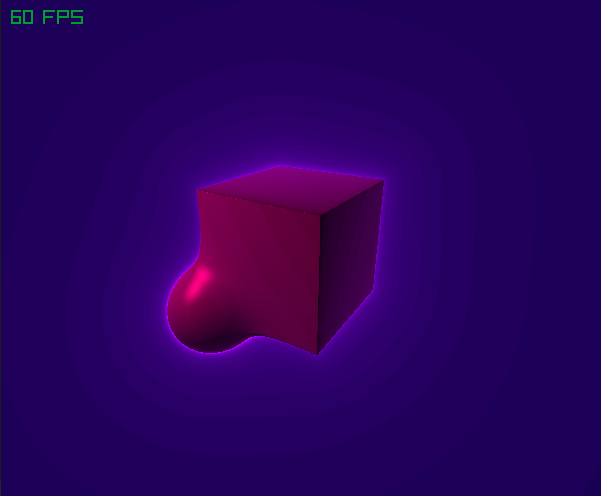

# RayMarcher3D

A minimal 3D renderer using **ray marching** and **signed distance fields (SDFs)** to visualize procedural 3D shapes.  
Shape SDFs are based on work by [**Inigo Quilez**](https://iquilezles.org/).  
Built with **C++**, **OpenGL**and [**Raylib**](https://www.raylib.com/).

---

---

## ✨ Features

- Ray marching algorithm for accurate surface rendering with SDF (signed distance field) calculated shapes.
- Glow effect for enhanced visuals.
- Phong shading with ambient, diffuse and specular lighting.

---

## 🎮 Controls

| Key      | Action                              |
|----------|-------------------------------------|
| W / A / S / D | Move camera (forward, backward, strafe) |
| 1 / 2    | Decrease / Increase smoothing       |

---

TODO:
- Add support for more SDF shapes (torus, octahedron, custom functions)
- Implement camera rotation
- Add GUI to tweak rendering settings in real time
- Add per-shape materials
- Add more lighting effects
- Add more SDF blending operations (subtraction, intersection, etc.)
