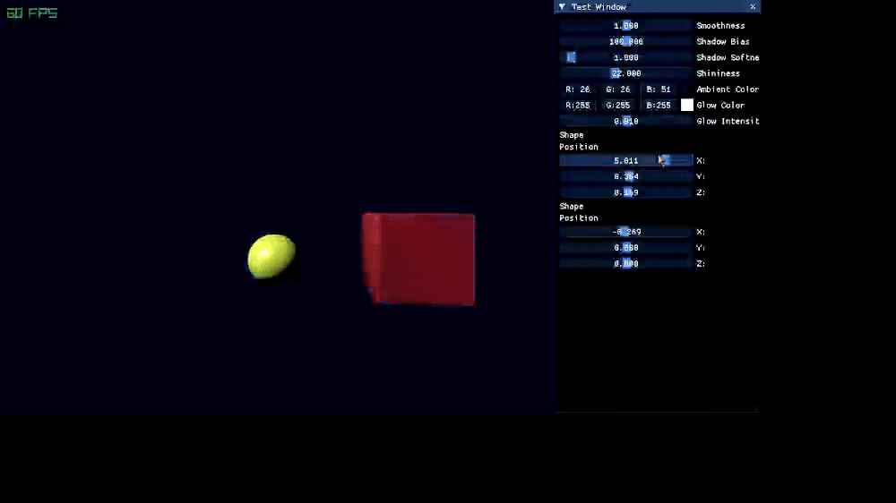

# RayMarcher3D

A minimal 3D renderer using **ray marching** and **signed distance fields (SDFs)** to visualize procedural 3D shapes.  
Shape SDFs are based on work by [**Inigo Quilez**](https://iquilezles.org/).  
Built with **C++**, **OpenGL** and [**Raylib**](https://www.raylib.com/).

---

---

## ✨ Features

- Ray marching algorithm for accurate surface rendering with SDF-based shapes.
- Performant GPU rendering in OpenGl.
- Tweakable scene parameters.
- Glow effect for enhanced visuals.
- Phong shading with ambient, diffuse and specular lighting.
- Ray marched soft shadows.
- Multiple shapes, including mandelbulb fractal. Per-object materials.

---

## 🎮 Controls

| Key      | Action                              |
|----------|-------------------------------------|
| W / A / S / D | Move camera (forward, backward, strafe) |
| LCtrl / Space | Move camera (up, down) |
| Mouse movement | Rotate camera |
| X | Enable / disable camera rotation |

---
## Issues
- light merges with scene when smoothing is enabled
- ambient occlusion provides poor results
- visual artefacts when res scale is low
- visual artefacts on mandelbulb

---

## TODO:
- Add support for more SDF shapes (cylinder, octahedron, custom functions).
- Add resizable objects list.
- Add more material parameters.
- Add multiple light support.
- Add more SDF blending operations (subtraction, intersection, etc.).
